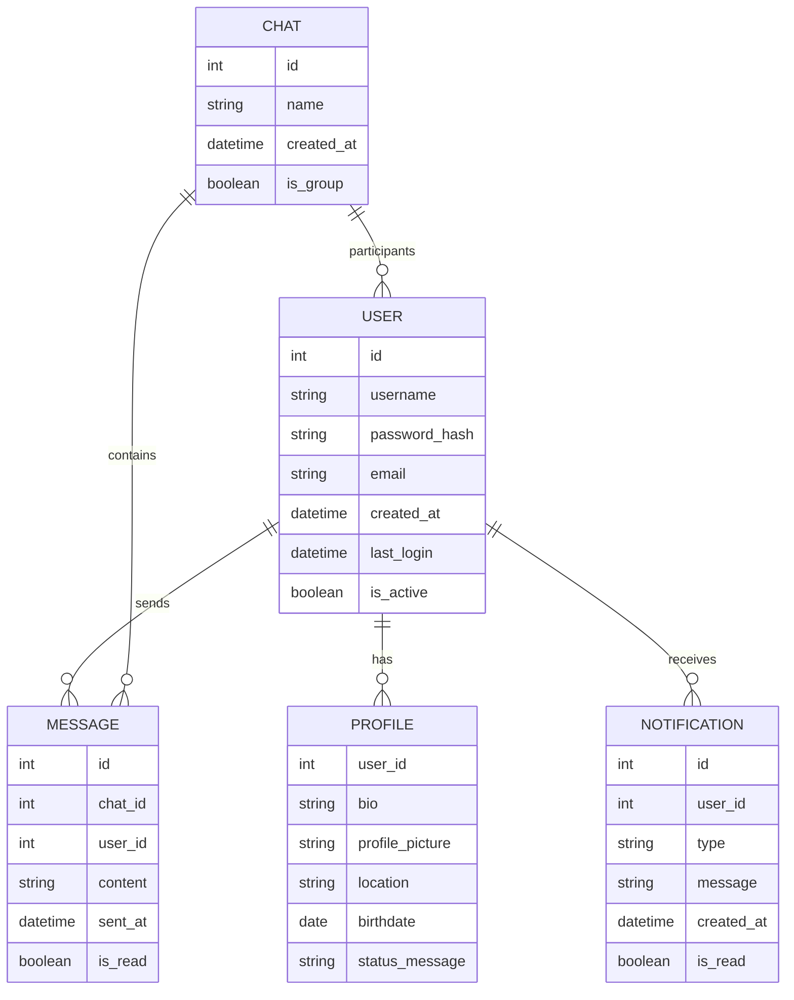

# FamChat
A simple, secure chat app designed to keep your family connected over your home Wi-Fi network. Whether you're in the next room or across the house, stay in touch with those who matter most, all within your local network.

## Stack
  

## Features
- **Emoji Reactions**: Let family members react to messages with a variety of emojis.
- **Message Bubbles with Themes**: Customize chat bubbles with fun themes.

## Entity Relationship Diagram


## Project Setup
FamChat uses Docker for deployment and project creation.

```
git clone git@github.com:saltnepperson/FamChat.git

cd FamChat

docker-compose build
docker-compose up
```

## Authors
- [@saltnepperson](https://www.github.com/saltnepperson)
